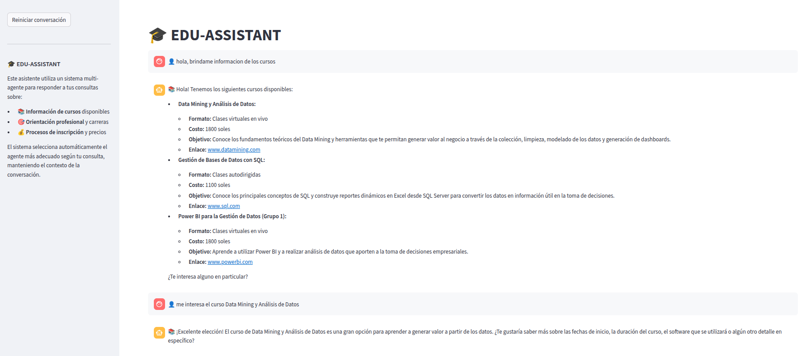
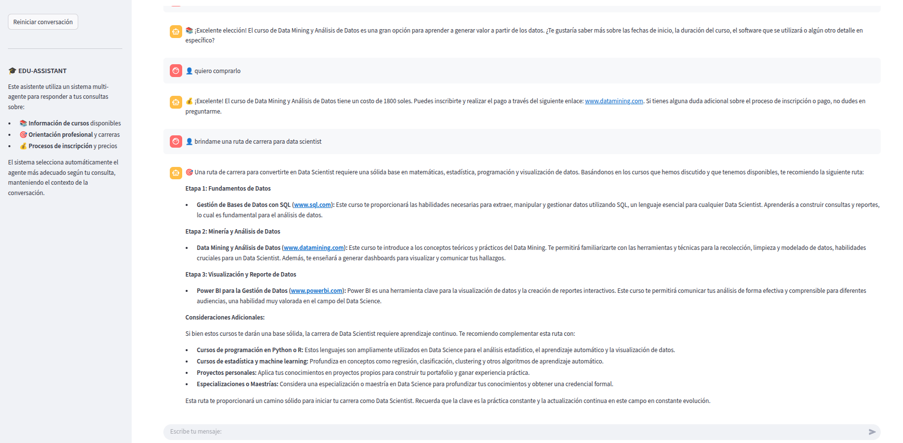
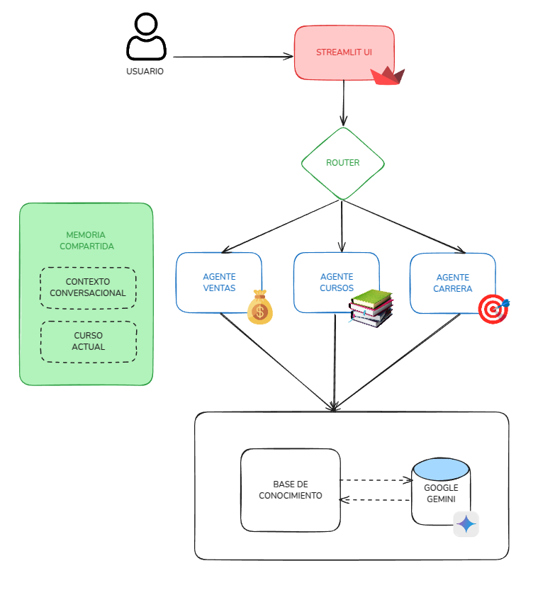

<div align="center">

# 🎓 Edu-Assistant

[](https://www.python.org/downloads/)
[](https://python-poetry.org/)
[](https://ai.google.dev/)
[](https://streamlit.io/)
[](https://www.langchain.com/)
[](https://edu-assistant-68uftfvbrmwowsiulr74mb.streamlit.app/)

**Asistente conversacional inteligente para instituciones educativas**

</div>

## 📋 Índice

- [🎓 Edu-Assistant](#-edu-assistant)
  - [📋 Índice](#-índice)
  - [🚀 Descripción General](#-descripción-general)
  - [✨ Características Principales](#-características-principales)
  - [📱 Demostración](#-demostración)
  - [🏗 Arquitectura](#-arquitectura)
  - [📦 Requisitos](#-requisitos)
  - [⚙️ Instalación](#️-instalación)
  - [🐳 Desarrollo con Dev Container](#-desarrollo-con-dev-container)
    - [Requisitos Previos](#requisitos-previos)
    - [Inicio Rápido](#inicio-rápido)
    - [Características del Dev Container](#características-del-dev-container)
  - [🔧 Configuración](#-configuración)
  - [🚀 Ejecución](#-ejecución)
    - [Usando Poetry](#usando-poetry)
  - [📂 Estructura del Proyecto](#-estructura-del-proyecto)
  - [🧩 Agentes Especializados](#-agentes-especializados)
  - [📊 Base de Conocimiento](#-base-de-conocimiento)
  - [🛠 Desarrollo y Contribución](#-desarrollo-y-contribución)
    - [Entorno de Desarrollo](#entorno-de-desarrollo)
    - [Directrices para Contribuciones](#directrices-para-contribuciones)
  - [📈 Roadmap](#-roadmap)
  - [📄 Licencia](#-licencia)
  - [🚀 Despliegue en Streamlit Cloud](#-despliegue-en-streamlit-cloud)
    - [Solución de problemas comunes](#solución-de-problemas-comunes)

## 🚀 Descripción General

Edu-Assistant es una plataforma de asistencia educativa impulsada por IA Generativa, diseñada específicamente para **instituciones educativas**. Utilizando una arquitectura multi-agente sofisticada, el sistema proporciona:

- **Asistencia conversacional** en lenguaje natural sobre cursos y programas
- **Orientación personalizada** para trayectorias profesionales
- **Apoyo en el proceso de inscripción** y ventas

El sistema mantiene un historial compartido entre agentes, garantizando conversaciones coherentes y contextuales que mejoran significativamente la experiencia del usuario.

**[👉 Prueba la aplicación en vivo](https://edu-assistant-68uftfvbrmwowsiulr74mb.streamlit.app/)**

## ✨ Características Principales

- 💬 **Interfaz conversacional intuitiva** desarrollada con Streamlit
- 🧠 **Sistema multi-agente inteligente** con especialización por dominio
- 📚 **Respuestas precisas sobre cursos** (contenido, duración, precio, etc.)
- 🧭 **Recomendaciones personalizadas** basadas en objetivos profesionales
- 💰 **Asistencia en proceso de compra** con enfoque consultivo
- 🔄 **Memoria compartida entre agentes** para mantener coherencia
- 📊 **Trazabilidad completa** de todas las interacciones
- 🔍 **Mantenimiento contextual** para conversaciones más naturales

## 📱 Demostración

A continuación, puedes ver el asistente en acción:

<div align="center">
  <p><strong>✨ <a href="https://edu-assistant-68uftfvbrmwowsiulr74mb.streamlit.app/" target="_blank">¡Prueba la aplicación en vivo!</a> ✨</strong></p>
  <br>
  
  
  <p><em>Consulta de información sobre cursos disponibles</em></p>
  
  <br>
  
  
  <p><em>Recomendaciones personalizadas basadas en objetivos profesionales</em></p>
</div>

## 🏗 Arquitectura

El sistema utiliza una arquitectura de agentes especializados con las siguientes capas:

<div align="center">
  
</div>

El diagrama muestra el flujo de datos en el sistema multi-agente:
1. El **usuario** interactúa a través de la interfaz Streamlit
2. El **router** analiza el mensaje y selecciona el agente más apropiado
3. Los **agentes especializados** (Cursos, Carreras, o Ventas) procesan la consulta
4. Todos los agentes comparten **memoria y contexto** para mantener conversaciones coherentes
5. Las respuestas se generan utilizando el modelo de **Google Gemini** y se presentan al usuario

A continuación se muestra una representación simplificada de la arquitectura en formato ASCII:

```
┌───────────────────┐
│  Interfaz Usuario │ Streamlit UI conversacional
└─────────┬─────────┘
          │
┌─────────▼─────────┐
│  Router Inteligente│ Selección de agente basada en intención
└─────────┬─────────┘
          │
┌─────────▼─────────────────────────────────┐
│            Agentes Especializados         │
├───────────┬───────────────┬───────────────┤
│ Cursos    │ Carreras      │ Ventas        │
└───────────┴───────┬───────┴───────────────┘
                    │
┌───────────────────▼───────────────────────┐
│            Sistemas de Soporte            │
├───────────┬───────────────┬───────────────┤
│ Memoria   │ Conocimiento  │ Modelo IA     │
│ Compartida│ Estructurado  │ (Google Gemini)│
└───────────┴───────────────┴───────────────┘
```

## 📦 Requisitos

- **Python**: 3.10 o superior
- **Poetry**: Gestión de dependencias
- **API Key**: Google Generative AI (Gemini)
- **Base de Conocimiento**: Archivo Excel estructurado (incluido)

## ⚙️ Instalación

```bash
# Clonar el repositorio
git clone https://github.com/yourusername/edu-assistant.git
cd edu-assistant

# Instalar dependencias con Poetry
poetry install

# Alternativa con Docker
docker build -t edu-assistant .
```

## 🐳 Desarrollo con Dev Container

Este proyecto incluye configuración para [Visual Studio Code Dev Containers](https://code.visualstudio.com/docs/devcontainers/containers), lo que permite desarrollar dentro de un contenedor Docker completamente configurado.

### Requisitos Previos
- [Visual Studio Code](https://code.visualstudio.com/)
- [Docker](https://www.docker.com/products/docker-desktop/)
- Extensión [Dev Containers](https://marketplace.visualstudio.com/items?itemName=ms-vscode-remote.remote-containers) para VS Code

### Inicio Rápido
1. Clona el repositorio
2. Abre el proyecto en VS Code
3. Cuando aparezca la notificación "Folder contains a Dev Container configuration file", haz clic en "Reopen in Container"
   - O usa el comando `Remote-Containers: Reopen in Container` desde la paleta de comandos (F1)
4. VS Code reconstruirá y abrirá el proyecto dentro del contenedor de desarrollo con todas las dependencias y extensiones preinstaladas

### Características del Dev Container
- Python 3.10 preconfigurado
- Poetry para gestión de dependencias
- Oh-My-Zsh con tema `robbyrussell`
- Extensiones de VS Code preinstaladas:
  - Python, Pylance, Black, Ruff
  - Git tools
  - Extensiones para Jupyter, Markdown, HTML
- Configuración de linting y formateo automático al guardar

## 🔧 Configuración

1. **Crea un archivo `.env` en el directorio raíz** basado en el archivo `.env.example`:

```bash
# Copiar la plantilla de ejemplo
cp .env.example .env

# Editar el archivo con tu editor favorito
nano .env
```

2. **Actualiza las variables de entorno** en el archivo `.env`:
```
GEMINI_API_KEY=tu_api_key_de_google_gemini_aqui
```

3. **Verifica que la base de conocimiento** esté en `data/knowledge_base_Caso.xlsx`

## 🚀 Ejecución

### Usando Poetry

```bash
# Interfaz Streamlit (recomendada)
poetry run python -m streamlit run ui/streamlit_app.py

# Interfaz CLI para pruebas
poetry run python -m app.main
```

## 📂 Estructura del Proyecto

```
edu-assistant/
├── app/                   # Código principal
│   ├── agents/            # Implementación de agentes especializados
│   │   ├── base.py        # Clase base para todos los agentes
│   │   ├── cursos.py      # Especialista en información de cursos
│   │   ├── carreras.py    # Especialista en trayectorias profesionales
│   │   └── ventas.py      # Especialista en proceso de inscripción
│   ├── router/            # Selección inteligente de agentes
│   ├── utils/             # Utilidades comunes
│   │   └── data_loader.py # Carga y procesamiento de datos
│   ├── memory/            # Gestión de historial conversacional
│   ├── config.py          # Configuración centralizada
│   └── main.py            # Punto de entrada (CLI)
├── data/                  # Datos y bases de conocimiento
│   └── knowledge_base_Caso.xlsx
├── ui/                    # Interfaces de usuario
│   └── streamlit_app.py   # Aplicación web con Streamlit
├── tests/                 # Pruebas automatizadas
├── scripts/               # Scripts auxiliares
├── Dockerfile             # Configuración para dev-container
├── pyproject.toml         # Configuración de Poetry
└── README.md              # Esta documentación
```

## 🧩 Agentes Especializados

El sistema implementa tres agentes principales, cada uno con un rol específico:

| Agente            | Rol                        | Capacidades                                                |
| ----------------- | -------------------------- | ---------------------------------------------------------- |
| **CursosAgent**   | 📚 Especialista en cursos   | Detalles técnicos, contenidos, requisitos, duración        |
| **CarrerasAgent** | 🧭 Orientador profesional   | Recomendaciones de rutas formativas, salidas laborales     |
| **VentasAgent**   | 💰 Consultor de inscripción | Precios, descuentos, proceso de matrícula, métodos de pago |

Cada agente mantiene su propio contexto especializado mientras comparte el historial conversacional completo.

## 📊 Base de Conocimiento

La información se estructura en un archivo Excel con múltiples hojas:

- **Cursos**: Catálogo completo con metadatos (nombre, duración, nivel, etc.)
- **Precios**: Información detallada sobre tarifas y promociones
- **Carreras**: Rutas profesionales recomendadas según objetivos

Esta estructura facilita la actualización periódica sin necesidad de modificar el código.

## 🛠 Desarrollo y Contribución

### Entorno de Desarrollo

```bash
# Configurar entorno de desarrollo
poetry install --with dev

# Ejecutar pruebas
poetry run pytest

# Verificar formato de código
poetry run black .
poetry run isort .
```

### Directrices para Contribuciones

1. Crea un fork del repositorio
2. Crea una rama para tu característica (`git checkout -b feature/amazing-feature`)
3. Haz commit de tus cambios (`git commit -m 'Add amazing feature'`)
4. Haz push a la rama (`git push origin feature/amazing-feature`)
5. Abre un Pull Request

## 📈 Roadmap

| Fase | Característica                       | Estado        |
| ---- | ------------------------------------ | ------------- |
| 1️⃣    | Enrutamiento basado en LLM           | ✅ Completado  |
| 1️⃣    | Memoria compartida entre agentes     | ✅ Completado  |
| 1️⃣    | Interfaz Streamlit                   | ✅ Completado  |
| 2️⃣    | Persistencia de conversaciones en DB | 🔄 En progreso |
| 2️⃣    | Análisis de efectividad por agente   | 🔄 En progreso |
| 3️⃣    | Capacidades multimodales             | 🔮 Futuro      |

## 📄 Licencia

Este proyecto está licenciado bajo la licencia MIT. Consulta el archivo `LICENSE` para más detalles.

## 🚀 Despliegue en Streamlit Cloud

> **¡Ya disponible en vivo!** Prueba la aplicación en: [https://edu-assistant-68uftfvbrmwowsiulr74mb.streamlit.app/](https://edu-assistant-68uftfvbrmwowsiulr74mb.streamlit.app/)

Para desplegar tu propia versión de la aplicación en [Streamlit Cloud](https://streamlit.io/cloud):

1. **Fork o clona** este repositorio en GitHub

2. **Conecta tu repositorio** a Streamlit Cloud
   - En el dashboard de Streamlit Cloud, haz clic en "New app"
   - Selecciona el repositorio
   - En "Main file path" ingresa: `ui/streamlit_app.py`

3. **Configura los secretos de la aplicación**
   - En la configuración de la app, ve a la sección "Secrets"
   - Añade tu API key de Google Gemini:
   ```yaml
   GEMINI_API_KEY: "tu_api_key_de_gemini_aqui"
   ```

4. **Despliega la aplicación**
   - Haz clic en "Deploy"
   - Espera a que la aplicación se construya y despliegue

Una vez desplegada, tu aplicación se verá similar a las imágenes de demostración mostradas [arriba](#-demostración), con una interfaz conversacional completamente funcional.

### Solución de problemas comunes

Si la aplicación falla con un error `No module named 'app'`, verifica que el archivo `ui/streamlit_app.py` incluya la línea para modificar el sys.path al inicio del archivo:

```python
import sys
import os
sys.path.insert(0, os.path.abspath(os.path.join(os.path.dirname(__file__), '..')))
```

Para más detalles sobre la configuración de Streamlit Cloud, consulta el archivo `.streamlit/README.md`.

---

<div align="center">
  <p>
    <strong>Edu-Assistant</strong> - Transformando la experiencia educativa con IA Generativa<br>
    Desarrollado por <a href="mailto:reisson.saavedra.miguel@gmail.com">Reisson Saavedra</a>
  </p>
</div>